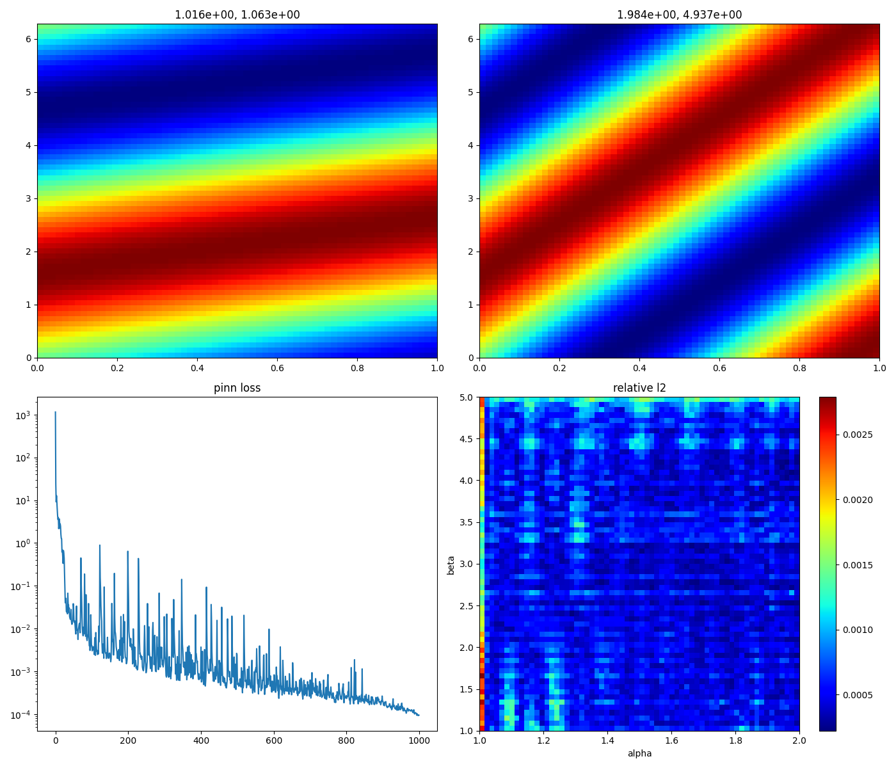

# Separable (Physics-Informed) Deep Operator Networks.

Separable Physics Informed Neural Networks ([SPINNs](https://github.com/stnamjef/SPINN)) excel at approximating complex partial differential equations (PDEs) on the box domain in remarkably short timeframes when compared to the Vanilla [PINNs](https://github.com/maziarraissi/PINNs).
The inherent low-rank tensor decomposition of SPINNs makes them highly adaptable to Operator Learning scenarios.

In this repository, we explore a toy example defined by the PDE:
$$ \partial_t u +\beta\partial_xu = 0,$$
with initial conditions $\alpha \sin(x)$, over the periodic spatial domain.
Our goal in this context is to approximate the solution operator:
$$ (\alpha, \beta) \mapsto u.$$
The computational domain is defined by $(t,x,\alpha, \beta) \in [0, 1]\times [0, 2\pi]\times [1, 2] \times [1, 5]$.

The resulting visualization is presented below:

The entire training process was completed in 22 minutes, utilizing the Nvidia GPU RTX 3090.